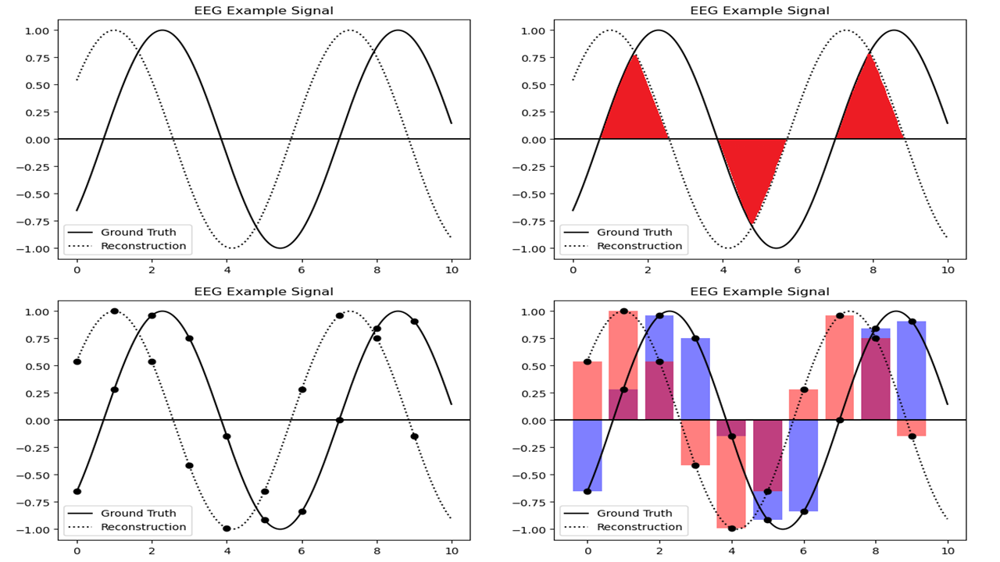

# SDSC:A Structure-Aware Metric for Semantic Signal Representation Learning

<!-- 
<p align="center">
<a href="https://ign0relee.github.io/sdsc" style="text-decoration: none;">

</a>
<a href="." style="text-decoration: none;">

</a>
<a href="https://arxiv.org/abs/2507.14516" style="text-decoration: none;">

</a>   
</p> -->


Baseline Code : [LINK](https://github.com/thuml/SimMTM)

Baseline Model Paper Link : [LINK](https://neurips.cc/virtual/2023/poster/70829)



<center>

__Fig. Signal Dice Coeffiecient__

</center>

### Dice Coefficient(DSC)
Given two sets, X and Y, it is defined as

$$
DSC = \frac{|2X \cap Y|}{|X| + |Y|}
$$

When |X| and |Y| are the cardinalities of the two sets. Inspired by this concept, we adapted the perspective of viewing signals to employ the Dice Coefficient as a comparative metric between two signals. Simply put, if the integral difference between two signals is zero, they can be considered identical. Given two signals? functions $E(\cdot)$  and $R(\cdot)$, defined as

### Signal Dice Coefficient(SDSC)
$$
S(x) = E(x) \cdot R(x)
$$

$$
M(x) = \frac{\{(|E(x)| + |R(x)|) - ||E(x)| -|R(x)||\}}{2}
$$

$$
SDSC(t) = \frac{2 \times \int H(S(t)) \cdot M(t)\, dt}{ \int [E(t) + R(t)]\, dt }
$$

$H(\cdot)$ is Heaviside function, $t \in T$ is given time. our objective is to optimize $SDSC(\cdot)$ to 1. While straightforward, this concept poses challenges for the continuous and complex nature of EEG signals. EEG signals, characterized by their waveform patterns, are continuous and irregular yet always sampled at a constant rate. This means our data can be understood as continuous but discretely interpretable, necessitating a redefinition of the problem. Rather than calculating the integral difference between two signals, we can understand the task as making the sampled signals at the same moment have the same intensity. 


$$
SDSC(t) \approx SDSC(s) = \frac{2 \times \sum H(S(s)) \cdot M(s)\,}{ \sum (E(s) + R(s))\,}
$$


$s \in S$ represents discrete sampling points in time, then set $S \subset T$. $SDSC(s)$ can approximate $SDSC(t)$ from the observed values and is easier by converting integration into addition operations. Unlike MSE, SDSC depends on signal intensity, making it more sensitive to data peaks


## Intallation
```
Python == 3.10.16
pytorch >= 2.6.0
opencv-python == 4.11.0.86
tensorboardX == 2.6.2.2
matplotlib == 3.10.1
seaborn    == 0.13.2
numpy      == 1.26.4
pysdtw     == 0.0.5
pandas     == 2.2.3
```

## Get Started

See [Link](https://github.com/thuml/SimMTM?tab=readme-ov-file#get-started)


## Main Codes
Signal Dice Similarity Coefficient Codes : [LINK](./libs/metric.py)

Signal Dice Similarity Loss Codes : [LINK](./libs/losses.py)


## Citation
Not ready yet
<!-- 
## Contact
If you have any questions, please contact dlwpdud@catholic.ac.kr -->

## Acknowledgement